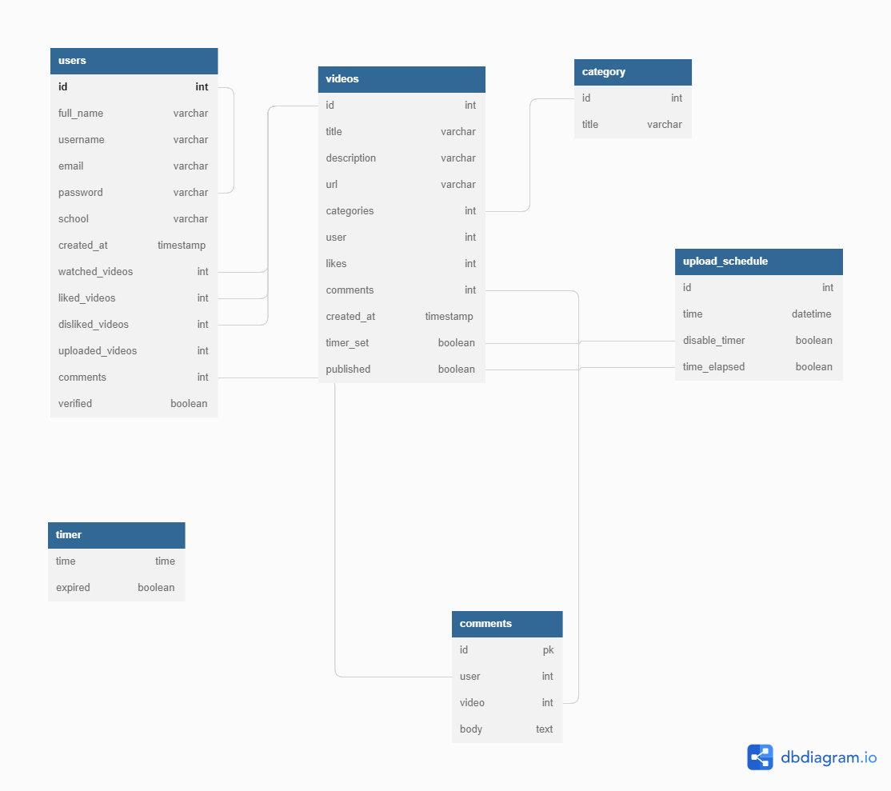

# Col-films-Team-120

## A streaming platform for college students

## Introduction

A web application that allows college students to upload, watch and share short videos from their comfort while enforcing time management to enable a productive lifestyle

#### Tech Stack - Python/Django

## Table of Contents

1. [Introduction](#introduction)
2. [Installation](#how-to-install)
3. [Usage](#how-to-use)
4. [Resources](#Resources)
5. [Images](#images)
6. [Contributors](#contributors)

## How to install

- Clone the github repository
- Install libraries from requirements.txt
- Run all migrations

```python
    python manage.py makemigrations
    python manage.py migrate
```

- Start up server

```python
    python manage.py runserver
```

Two databases are set-up comment out the one not desired, by default sqlite is enabled
update in settings.py

###### IT IS RECOMMENDED TO USE POSTGRES IN PRODUCTION

```python
 DATABASES = {
    'default': {
        'ENGINE': 'django.db.backends.postgresql',
        'NAME': 'collywood',
        'USER': 'collywood-admin',
        'PASSWORD': 'collywood-admin@321',
        'HOST': 'db',
        'PORT': 5432
    }
}

DATABASES = {
    'default': {
        'ENGINE': 'django.db.backends.sqlite3',
        'NAME': 'db',
    }
}
```

if running on a production server update settings.py. set Debug=False

```python
DEBUG=False
```

## How to use

- Start up the server
- It is advisable to clone the development branch if running on a local server
- Watch videos by selecting a video on the homepage
- React to videos (like, comment, dislike)
- Create account to upload videos
- Login with account
- The static files are served from the static folder in the base directory

# Resources

- [Figma Board](https://www.figma.com/file/SrpBl1g9DxXzRwSgnTJ9h6/Style-Guide?node-id=0%3A1)
- [Figjam Board](https://www.figma.com/file/MDitz2vW5HJ1Hw9z9DmYSQ/Team-120-notes?node-id=0%3A1)
- [Research plan](https://docs.google.com/document/d/1JeivVsSsdrnkBP0AYehKlBAZN6f1ZVOp6qz0ofOUWUc/edit?usp=sharing)

## Images



## Contributors

There is a contributions folder attached to the developement branch which is our default branch, there you will find the contributions readme of each of our team members

- [Olomi Gift - Designer](https://www.github.com/mehetabelgift)
- [Ogieleguea Hillary - Developer](https://www.github.com/hillarywebb-coder)
- [Anyiam David - Designer](https://www.github.com/dravidTML)
- [Chisom Kalu - Designer](https://www.github.com/chisomkalu)
- [Abibat Shittu - Designer](https://www.github.com/abibatshittu)
- [Abigail Addo - Designer](https://www.github.com/asaddo444)
- [Favour Nwachukwu - Designer](https://www.github.com/billyfaychi)
- [Ladejobi Moses - Designer](https://www.github.com/mola71)
- [Bolaji Jimon Adigun - Developer](https://www.github.com/bolajiomo99)
- [Tomilayo Abimbola - Designer](https://www.github.com/tomilayoA)
- [Gideon Akinola - Designer](https://www.github.com/blvckcoco)
- [Olawuwo Ajibola - Designer](https://www.github.com/lawuwoabeeb)
